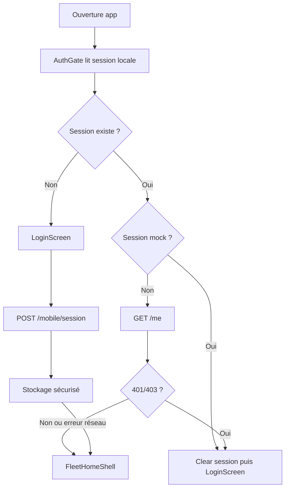
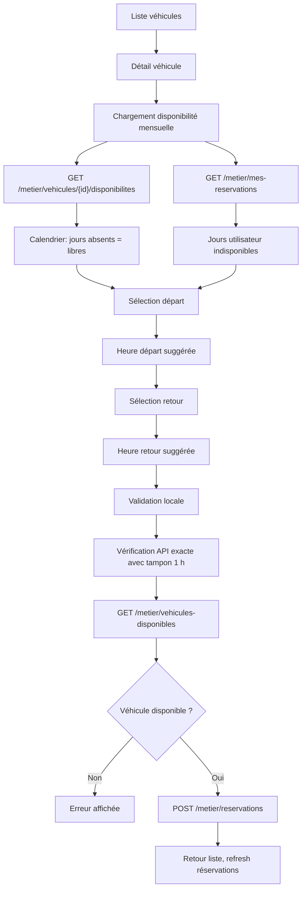
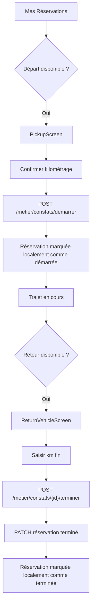
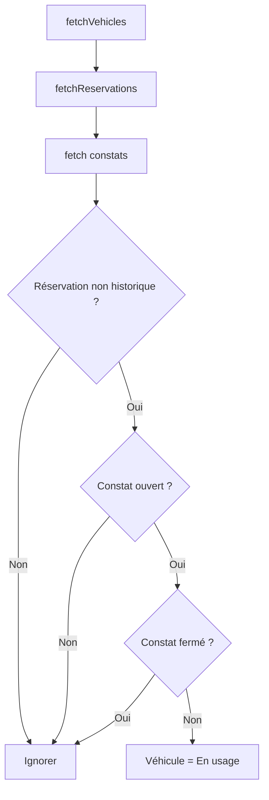

# Documentation technique complète - Wheello

Date de rédaction : 4 juin 2026  
Projet analysé : `mobile_habitat_insertion`  
Technologie principale : Flutter / Dart  
Finalité : application mobile de gestion de flotte de véhicules, centrée sur la réservation, la prise en charge, le retour, les constats, les signalements et les notifications.

---

## 1. Résumé exécutif

Wheello est une application Flutter pour utilisateurs mobiles rattachés à une flotte de véhicules Habitat Insertion. L'utilisateur se connecte avec un e-mail ou un identifiant interne, consulte les véhicules auxquels il a accès, filtre la liste, ouvre une fiche véhicule, réserve une période, consulte ses réservations, démarre un trajet via un constat de départ, termine le trajet via un constat de retour, signale des anomalies et consulte ses notifications.

Le projet est structuré autour de cinq couches principales :

- `models` : objets métier immuables ou quasi immuables utilisés par l'interface.
- `services` : accès API, session, notifications, vidéos et mappers JSON.
- `screens/fleet` : écrans utilisateur de l'application flotte.
- `widgets` : composants réutilisables, calendriers, cartes, navigation, barres d'action.
- `utils` : règles transversales de calcul de conflits de réservation.

L'application communique avec une API métier sous `/metier/...`, via un `ApiClient` commun qui gère les requêtes JSON, le multipart, les erreurs API et le jeton Bearer stocké en local.

Les points métier les plus sensibles sont :

- un véhicule est considéré en usage seulement s'il existe un constat ouvert sans constat fermé correspondant ;
- un constat fermé ne suffit pas à mettre une réservation dans l'historique : c'est le statut de réservation `terminé`/`termine` côté API qui fait foi ;
- une journée partielle reste réservable à certaines heures ;
- les jours non renvoyés par la route mensuelle de disponibilité sont considérés libres ;
- une réservation réelle est validée avec la route exacte `/metier/vehicules-disponibles`, en ajoutant un tampon d'une heure avant le départ et après le retour ;
- l'utilisateur ne peut pas choisir un jour passé ni une heure passée ;
- l'app évite les doubles réservations utilisateur, même sur des véhicules différents ;
- l'écran de modification ignore la réservation d'origine pour pouvoir la déplacer sans se bloquer elle-même.

---

## 2. Arborescence utile

```text
.
├── assets/
│   ├── .env.local
│   └── images/branding/
│       ├── wheello_app_logo.png
│       └── wheello_home_logo.png
├── lib/
│   ├── data/
│   ├── models/
│   ├── navigation/
│   ├── screens/fleet/
│   ├── services/
│   ├── theme/
│   ├── utils/
│   ├── widgets/
│   └── main.dart
├── test/
├── android/
├── ios/
├── macos/
├── linux/
├── windows/
├── web/
├── pubspec.yaml
└── analysis_options.yaml
```

Les dossiers `android`, `ios`, `macos`, `linux`, `windows` et `web` sont les wrappers natifs générés par Flutter. La logique applicative est très majoritairement dans `lib`.

---

## 3. Stack technique

### 3.1 SDK et dépendances

Fichier : [`pubspec.yaml`](../pubspec.yaml)

```yaml
environment:
  sdk: ^3.10.4
```

Dépendances principales :

- `flutter_dotenv` : lecture de `assets/.env.local`, notamment `API_BASE_URL`.
- `flutter_secure_storage` : stockage local sécurisé du jeton et des informations de session.
- `http` : client HTTP.
- `camera`, `image_picker` : capture vidéo depuis l'application.
- `path`, `path_provider` : support fichiers et chemins.
- `permission_handler` : permissions natives, notamment notifications.
- `flutter_lints` : règles de lint recommandées.

### 3.2 Assets

Fichier : [`pubspec.yaml`](../pubspec.yaml)

```yaml
assets:
  - assets/.env.local
  - assets/images/branding/
```

Le projet charge :

- `assets/.env.local` au démarrage ;
- `wheello_app_logo.png` sur l'écran de connexion ;
- `wheello_home_logo.png` dans la barre supérieure.

### 3.3 Configuration native Android

Fichier : [`android/app/src/main/AndroidManifest.xml`](../android/app/src/main/AndroidManifest.xml)

Permissions déclarées :

- `INTERNET` : accès API et images distantes.
- `CAMERA` : capture vidéo.
- `RECORD_AUDIO` : audio de vidéo.
- `READ_MEDIA_VIDEO` : accès média vidéo Android récent.
- `POST_NOTIFICATIONS` : notifications Android 13+.

Nom affiché Android : `Wheello`.

### 3.4 Configuration native iOS

Fichier : [`ios/Runner/Info.plist`](../ios/Runner/Info.plist)

Le nom affiché est `Wheello`. Le fichier iOS lu ne contient pas actuellement les clés de description d'usage caméra/micro/photo, par exemple `NSCameraUsageDescription`, `NSMicrophoneUsageDescription`, `NSPhotoLibraryUsageDescription`. Comme l'application utilise la capture vidéo, ces clés peuvent être nécessaires pour un build iOS destiné à l'App Store ou à un appareil réel.

---

## 4. Point d'entrée de l'application

Fichier : [`lib/main.dart`](../lib/main.dart)

Le `main` fait trois choses :

1. initialise Flutter ;
2. charge `assets/.env.local` ;
3. lance `WheelloApp`.

```dart
Future<void> main() async {
  WidgetsFlutterBinding.ensureInitialized();
  await dotenv.load(fileName: 'assets/.env.local');
  runApp(const WheelloApp());
}
```

`WheelloApp` crée un `MaterialApp` avec :

- titre : `Wheello` ;
- thème : `AppTheme.light` ;
- page initiale : `AuthGate`, sauf en test avec `forceLogin: true` ;
- routes nommées :
  - `/connexion` -> `LoginScreen`
  - `/accueil` -> `FleetHomeShell`

---

## 5. Navigation globale

Fichier : [`lib/navigation/app_routes.dart`](../lib/navigation/app_routes.dart)

```dart
class AppRoutes {
  static const login = '/connexion';
  static const home = '/accueil';
}
```

L'application combine :

- routes nommées pour connexion/accueil ;
- `MaterialPageRoute` direct pour les écrans internes :
  - détail véhicule ;
  - modification de réservation ;
  - prise en charge ;
  - retour véhicule ;
  - signalement ;
  - notifications.

---

## 6. Thème et identité visuelle

### 6.1 Marque

Fichiers :

- [`lib/theme/app_brand.dart`](../lib/theme/app_brand.dart)
- [`lib/theme/app_assets.dart`](../lib/theme/app_assets.dart)

`AppBrand.name` vaut `Wheello`.

`AppAssets` centralise les chemins :

- `appLogo` : logo de connexion ;
- `homeLogo` : logo de barre supérieure.

### 6.2 Couleurs

Fichier : [`lib/theme/app_colors.dart`](../lib/theme/app_colors.dart)

Couleurs métier importantes :

- `primary` : bleu principal `#005BBF`.
- `available` : vert libre `#059669`.
- `partial` : bleu disponibilité partielle `#0EA5E9`.
- `error` : rouge réservé/erreur `#BA1A1A`.
- `maintenance` : orange maintenance `#D97706`.
- `userUnavailable` : violet indisponibilité utilisateur `#7C3AED`.

Les couleurs d'état ne sont pas seulement décoratives : elles sont utilisées par `VehicleStatus`, `AvailabilityStatus`, les calendriers, les cartes de réservation et les notifications.

### 6.3 Thème Material

Fichier : [`lib/theme/app_theme.dart`](../lib/theme/app_theme.dart)

Le thème :

- active Material 3 ;
- utilise `Inter` comme police ;
- configure un `ColorScheme` depuis `AppColors.primary` ;
- définit les styles d'`AppBar`, `InputDecoration`, `FilledButton`, `SnackBar`.

Attention : la police `Inter` est référencée mais aucun asset de police n'est déclaré dans `pubspec.yaml`. Si Flutter ne trouve pas Inter sur la plateforme, il utilisera la police système.

---

## 7. Modèles métier

## 7.1 Véhicules

Fichier : [`lib/models/vehicle.dart`](../lib/models/vehicle.dart)

### `VehicleStatus`

```dart
enum VehicleStatus { inUse, available, maintenance }
```

États :

- `inUse` : libellé `En usage`, couleur rouge, icône voiture.
- `available` : libellé `Libre`, couleur verte, icône voiture électrique.
- `maintenance` : libellé `En maintenance`, couleur orange, icône outil.

`sortRank` classe les véhicules :

- `inUse` -> 1 ;
- `available` -> 3 ;
- `maintenance` -> 4.

`canBeUsedAsFilter` exclut `maintenance` des filtres de statut affichés dans la liste des véhicules.

### `AvailabilityStatus`

```dart
enum AvailabilityStatus { free, partial, reserved, maintenance }
```

États du calendrier de disponibilité :

- `free` : jour libre ;
- `partial` : jour partiellement libre ;
- `reserved` : jour réservé ;
- `maintenance` : jour en maintenance.

La propriété clé :

```dart
bool get canStartReservation
```

Elle renvoie :

- `true` pour `free` et `partial` ;
- `false` pour `reserved` et `maintenance`.

C'est ce qui autorise un clic sur un jour partiellement disponible.

### `VehicleAvailabilityMonth`

```dart
class VehicleAvailabilityMonth {
  final Map<int, AvailabilityStatus> availabilityByDay;
  final Map<int, VehicleAvailabilitySuggestion> suggestionsByDay;
}
```

Ce modèle regroupe :

- l'état par jour du mois ;
- les suggestions horaires par jour.

Les suggestions sont calculées depuis les réservations existantes :

- `earliestStartAt` : heure minimum de départ conseillée, généralement retour précédent + 1 h ;
- `latestEndAt` : heure maximum de retour conseillée, généralement départ suivant - 1 h.

### `VehicleAvailabilitySuggestion.merge`

Le merge conserve :

- le départ le plus tardif parmi les suggestions `earliestStartAt` ;
- le retour le plus tôt parmi les suggestions `latestEndAt`.

Cela permet de combiner plusieurs contraintes le même jour sans ouvrir un créneau impossible.

### `VehicleEnergyType`

```dart
enum VehicleEnergyType { electric, hybrid, thermal }
```

`usesFuelLevel` vaut :

- `false` pour électrique ;
- `true` pour hybride et thermique.

Cette règle pilote les champs carburant dans les formulaires départ/retour.

### `VehicleIssue`

Représente une anomalie connue :

- titre ;
- description ;
- date/libellé de signalement ;
- drapeau `requiresAttention`.

### `Vehicle`

Modèle principal d'un véhicule :

- identité : `id`, `internalNumber`, `name`, `brand`, `model`, `plateNumber` ;
- classification : `category`, `status`, `priorityRank` ;
- affichage : `subtitle`, `imageUrl` ;
- localisation : `location`, `site`, `parkingDescription` ;
- caractéristiques : `seats`, `transmission`, `energyType`, `energyInfo` ;
- exploitation : `currentMileage`, `fuelLevelLabel`, `nextAvailableAt` ;
- disponibilité : `availabilityByDay` ;
- anomalies : `knownIssues`.

`copyWith` ne modifie volontairement que :

- `status` ;
- `subtitle` ;
- `nextAvailableAt` ;
- `priorityRank`.

Ce choix correspond au besoin actuel : ajuster l'état courant d'un véhicule après lecture des réservations/constats.

---

## 7.2 Réservations

Fichier : [`lib/models/reservation.dart`](../lib/models/reservation.dart)

### `ReservationStatus`

```dart
enum ReservationStatus { pickupToday, returnToday, upcoming, completed }
```

Libellés :

- `pickupToday` -> `Aujourd'hui`
- `returnToday` -> `Retour aujourd’hui`
- `upcoming` -> `À venir`
- `completed` -> `Terminée`

Dans l'état actuel du code, l'action associée est :

- `details` pour `pickupToday`, `returnToday`, `upcoming` ;
- `none` pour `completed`.

Les vrais boutons départ/retour ne dépendent plus seulement de ce champ : ils sont recalculés avec les méthodes temporelles de `FleetReservation`.

### `FleetReservation`

Champs principaux :

- `id`
- `vehicle`
- `location`
- `startAt`
- `endAt`
- `startLabel`
- `endLabel`
- `status`
- `expectedStartMileage`
- `createdAt`
- `hasOpenConstat`
- `hasClosedConstat`

Constantes métier :

```dart
static const editLockDelay = Duration(hours: 24);
static const pickupFormLeadTime = Duration(hours: 1);
static const returnFormLeadTime = Duration(hours: 1);
static const shortNoticeCancelDelay = Duration(hours: 1);
static const departureReminderDelay = Duration(minutes: 30);
static const returnReminderDelay = Duration(minutes: 30);
```

Règles :

- une réservation entre dans l'historique uniquement si `status == completed` ;
- une réservation est modifiable seulement plus de 24 h avant le départ ;
- une réservation est annulable :
  - avant la fenêtre de verrouillage de 24 h ;
  - ou pendant 1 h après création si elle a été créée à court délai ;
- le formulaire de départ s'ouvre à partir de 1 h avant le départ ;
- le formulaire de retour s'ouvre à partir de 1 h avant le retour, mais seulement si un constat est ouvert et pas fermé ;
- une réservation avec constat fermé ne peut pas redémarrer ;
- une réservation terminée gagne toujours contre un éventuel état de constat ouvert obsolète.

Important :

```dart
bool get isInHistory {
  return status == ReservationStatus.completed;
}
```

Le constat fermé seul ne suffit pas à classer la réservation dans l'historique. Cela évite de masquer prématurément des réservations si l'API n'a pas encore mis à jour le statut.

---

## 7.3 Notifications

Fichier : [`lib/models/app_notification.dart`](../lib/models/app_notification.dart)

`AppNotification` est un modèle d'affichage :

- `id`
- `title`
- `body`
- `timeLabel`
- `icon`
- `color`

Il ne contient pas toute la donnée API brute. Le mapping est fait dans `FleetApiMappers.notificationFromJson`.

---

## 8. Règles transversales de réservation

Fichier : [`lib/utils/reservation_calendar_days.dart`](../lib/utils/reservation_calendar_days.dart)

Ce fichier concentre les règles qui doivent rester cohérentes entre création, modification, calendrier et tests.

### 8.1 Tampon entre deux réservations

```dart
const reservationTurnaroundDuration = Duration(hours: 1);
```

Interprétation :

- si un véhicule est rendu à 08:00, il ne peut être repris qu'à partir de 09:00 ;
- si un prochain utilisateur part à 13:00, l'utilisateur précédent doit rendre au plus tard à 12:00.

### 8.2 Jours occupés par une réservation

Fonction :

```dart
occupiedReservationDaysForMonth(...)
```

Elle renvoie les jours du mois touchés par une réservation.

Cas important :

```dart
final lastOccupiedInstant = endAt.subtract(const Duration(microseconds: 1));
```

Cela évite de compter un jour de retour à minuit comme occupé. Exemple :

- réservation du 18 juin 08:30 au 19 juin 00:00 ;
- seul le 18 est occupé ;
- le 19 reste libre.

### 8.3 Indisponibilités de l'utilisateur

Fonction :

```dart
userUnavailableReservationDaysForMonth(...)
```

Elle marque les jours où l'utilisateur a déjà une réservation active, même sur un autre véhicule. Cela évite qu'un même utilisateur se réserve deux véhicules sur une période qui se chevauche.

Elle ignore :

- la réservation en cours d'édition ;
- l'historique ;
- les réservations avec constat fermé.

### 8.4 Détection d'un jour non réservables

Fonction :

```dart
reservationPeriodContainsUnavailableDayForMonth(...)
```

Elle regarde les jours occupés dans un mois donné et bloque si :

- le jour est dans `userUnavailableDays` ;
- le statut du véhicule n'a pas `canStartReservation`.

Ainsi :

- `free` passe ;
- `partial` passe ;
- `reserved` bloque ;
- `maintenance` bloque.

### 8.5 Chevauchement temporel exact

Fonction :

```dart
reservationPeriodsOverlap(...)
```

Formule :

```dart
firstStartAt.isBefore(secondEndAt.add(minimumTurnaround)) &&
secondStartAt.isBefore(firstEndAt.add(minimumTurnaround))
```

Avec `minimumTurnaround = Duration.zero`, les périodes sont testées strictement.

Avec `minimumTurnaround = reservationTurnaroundDuration`, le test impose l'heure de battement entre deux périodes.

Exemples :

- 07:00 -> 08:00 puis 09:00 -> 18:00 : autorisé avec tampon 1 h.
- 07:00 -> 08:00 puis 08:59 -> 18:00 : refusé.
- 06 juin -> 8 juin 12:00 puis 8 juin 13:00 -> 18:00 : autorisé.
- 06 juin -> 8 juin 12:01 puis 8 juin 13:00 -> 18:00 : refusé.

---

## 9. Couche API

## 9.1 Configuration de base URL

Fichier : [`lib/services/api_config.dart`](../lib/services/api_config.dart)

La base API vient de :

1. `API_BASE_URL` dans `assets/.env.local` ;
2. fallback codé :

```text
https://4743.s3.nuage-peda.fr/HabitatInsertion/api
```

La méthode `_normalizeBaseUrl` :

- enlève les `/` finaux ;
- remplace `localhost` et `127.0.0.1` par `10.0.2.2` sur Android, pour l'émulateur.

## 9.2 Client HTTP commun

Fichier : [`lib/services/api_client.dart`](../lib/services/api_client.dart)

`ApiClient` encapsule :

- `GET` JSON ;
- `POST` JSON ;
- `PATCH` JSON ;
- `DELETE` ;
- `POST multipart`.

Méthodes principales :

- `getMap`
- `getJson`
- `postMap`
- `post`
- `patchMap`
- `patch`
- `delete`
- `postMultipart`

`_headers` ajoute :

```text
Accept: application/json
Content-Type: application/json
Authorization: Bearer <token>
```

si `authenticated == true` et qu'un token existe.

Timeouts :

- JSON : 20 secondes ;
- multipart : 2 minutes.

La méthode `_uri` fusionne proprement le chemin de base et le chemin demandé. Exemple :

- base : `https://example.test/api`
- path : `/metier/mes-reservations`
- résultat : `https://example.test/api/metier/mes-reservations`

## 9.3 Gestion des erreurs API

Fichier : [`lib/services/api_exception.dart`](../lib/services/api_exception.dart)

`ApiException.fromResponse` tente de lire :

- `detail`
- `message`
- `title`
- `error`

Si la réponse est HTML ou texte brut, elle retire les tags HTML.

Deux messages sont normalisés :

- problème de clé JWT Lexik ;
- problème backend Doctrine recevant `DateTimeImmutable` au lieu de `DateTime`.

Objectif : afficher un message exploitable à l'utilisateur ou au développeur au lieu d'un brut incompréhensible.

## 9.4 Authentification

Fichiers :

- [`lib/services/auth_api_service.dart`](../lib/services/auth_api_service.dart)
- [`lib/services/auth_session_service.dart`](../lib/services/auth_session_service.dart)

### Connexion

Endpoint :

```text
POST /mobile/session
```

Body :

```json
{
  "identifier": "email-ou-identifiant"
}
```

La réponse attendue contient :

- `token`
- `user`

Le user est converti en `AccountSession`.

### Refresh de session

Endpoint :

```text
GET /me
```

Le token existant est conservé, mais les infos user sont rafraîchies.

### Stockage local

`AuthSessionService` stocke dans `flutter_secure_storage` :

- `jwt_token`
- `user_id`
- `user_email`
- `user_first_name`
- `user_last_name`
- `user_role`
- `user_pole`

Il gère `MissingPluginException` pour permettre aux tests ou à certains contextes sans plugin natif de ne pas crasher.

### Sessions mock

`saveMockAccountSession` existe encore, mais `AuthGate` supprime une session mock au démarrage :

```dart
if (session.isMockSession) {
  await _authSessionService.clearSession();
  return false;
}
```

Le flux réel est donc API-first.

---

## 10. Mapping API vers modèles

Fichier : [`lib/services/fleet_api_mappers.dart`](../lib/services/fleet_api_mappers.dart)

Ce fichier est central : il absorbe l'hétérogénéité de l'API et protège l'app des variations de noms de champs.

## 10.1 `vehicleFromJson`

Champs lus :

- `id`
- `marque`
- `modele`
- `immatriculation`
- `status`
- `sites`
- `numVehicule`
- `descriptif`

Règles :

- si pas de site : `Affectation non renseignée` ;
- numéro interne : `V-xxx` depuis `numVehicule` ou `V-id` ;
- énergie détectée par recherche texte sur marque/modèle/descriptif :
  - `hybrid`/`hybride` -> hybride ;
  - `diesel`/`essence`/`thermique` -> thermique ;
  - sinon électrique ;
- image par marque :
  - Peugeot ;
  - Renault ;
  - image par défaut.

Un véhicule en maintenance reçoit automatiquement une anomalie connue :

```text
Véhicule en maintenance
Indisponibilité définie depuis l'administration.
```

## 10.2 `reservationFromJson`

Champs lus :

- `id`
- `vehicule`
- `dateDebut`
- `dateFin`
- `createdAt`, `created_at`, `dateCreation`, `dateReservation`, `creeLe`
- status via plusieurs clés :
  - `statue`
  - `statut`
  - `statu`
  - `status`
  - `state`
  - `etat`
- constats via plusieurs variantes.

Les dates API sont converties avec :

```dart
DateTime.tryParse(value)?.toLocal()
```

## 10.3 Détection des constats

### Constat ouvert

Détection directe :

- `constatOuvert`
- `hasOpenConstat`
- `estOuvert`
- `openConstat`

Détection via objet `constat` ou liste `constats`.

Un constat est ouvert si :

- un booléen explicite le dit ;
- le statut contient `ouvert`, `open`, `cours`, `progress`, `demarr`, `démarr`, `active` ;
- une date de prise existe et aucun signe de fermeture n'existe.

### Constat fermé

Détection directe :

- `constatFerme`
- `hasClosedConstat`
- `retourConfirme`
- `returnConfirmed`
- `constatTermine`

Un constat est fermé si :

- `estOuvert == false` ;
- un kilométrage final existe ;
- une date de retour/fermeture existe.

## 10.4 Statut de réservation

Une réservation devient `completed` si le statut API contient :

- `term`
- `fini`
- `clos`
- `completed`
- `done`

Sinon :

- si `startAt` est aujourd'hui : `pickupToday` ;
- si `endAt` est aujourd'hui, passé, ou période en cours : `returnToday` ;
- sinon : `upcoming`.

Note importante : le statut temporel `returnToday` ne signifie pas que le véhicule est forcément en usage. L'usage réel dépend du constat ouvert/fermé.

## 10.5 Notifications

`notificationFromJson` lit :

- `id`
- `objet`
- `message`
- `date`
- `type`
- `lu`

Types reconnus :

- `reservation`
- `constat`
- `signalement`
- `mdp`
- fallback notification générique.

## 10.6 Réponses collection

`itemsFromResponse` accepte plusieurs formats :

- liste directe ;
- `items`
- `hydra:member`
- `member`
- `data`
- `results`
- `reservations`
- `vehicules`
- `sites`
- `notifications`
- `constats`

Cela permet de supporter à la fois des réponses maison et des réponses API Platform/Hydra.

## 10.7 Sérialisation des dates

```dart
static String iso(DateTime date) => date.toUtc().toIso8601String();
```

L'app envoie toujours des instants UTC explicites (`Z`) à l'API, tout en travaillant en local côté UI.

---

## 11. Service flotte

Fichier : [`lib/services/fleet_api_service.dart`](../lib/services/fleet_api_service.dart)

`FleetApiService` est la façade métier principale. Il dépend de `ApiClient`.

## 11.1 Endpoints consommés

| Fonction | Méthode | Endpoint |
|---|---:|---|
| Charger sites utilisateur | `GET` | `/metier/mes-sites` |
| Charger véhicules par site | `GET` | `/metier/sites/{siteId}/vehicules` |
| Fallback véhicules disponibles | `GET` | `/metier/vehicules-disponibles` |
| Charger réservations | `GET` | `/metier/mes-reservations` |
| Charger constats | `GET` | `/metier/mes-constats` |
| Disponibilités mensuelles | `GET` | `/metier/vehicules/{id}/disponibilites?mois=YYYY-MM` |
| Créer réservation | `POST` | `/metier/reservations` |
| Modifier réservation | `PATCH` | `/metier/reservations/{id}` |
| Supprimer réservation | `DELETE` | `/metier/reservations/{id}` |
| Vérifier disponibilité exacte | `GET` | `/metier/vehicules-disponibles?dateDebut=...&dateFin=...` |
| Démarrer constat | `POST` | `/metier/constats/demarrer` |
| Terminer constat | `POST` | `/metier/constats/{constatId}/terminer` |
| Marquer réservation terminée | `PATCH` | `/metier/reservations/{id}` |
| Signalement | `POST` | `/metier/signalements` |
| Upload vidéo | `POST multipart` | `/metier/videos` |

## 11.2 Chargement des véhicules

Méthode :

```dart
Future<List<Vehicle>> fetchVehicles()
```

Processus :

1. récupère `/metier/mes-sites` ;
2. pour chaque site, récupère `/metier/sites/{siteId}/vehicules` ;
3. déduplique les véhicules par id ;
4. si aucun véhicule n'est trouvé, fallback vers `/metier/vehicules-disponibles` sur une période maintenant -> +1 jour ;
5. enrichit l'état courant avec `_withCurrentReservationState` ;
6. trie par statut puis nom.

### État "en usage"

Le code ne fait pas confiance uniquement au champ `status` du véhicule. Il recalcule l'usage depuis les réservations et constats :

```dart
if (reservation.isInHistory ||
    !reservation.hasOpenConstat ||
    reservation.hasClosedConstat) {
  continue;
}
```

Donc un véhicule est en usage si :

- la réservation n'est pas historique ;
- elle a un constat ouvert ;
- elle n'a pas de constat fermé.

S'il existe un constat ouvert et un constat fermé, le véhicule est libéré.

## 11.3 Chargement des réservations

Méthode :

```dart
Future<List<FleetReservation>> fetchReservations()
```

Processus :

1. récupère `/metier/mes-reservations` ;
2. mappe chaque réservation ;
3. récupère l'index des constats via `_fetchConstatIndex` ;
4. enrichit chaque réservation :
   - par id réservation ;
   - par id véhicule ;
   - par date de prise/retour quand l'id réservation manque ;
5. trie par date de départ.

`_fetchConstatIndex` sépare :

- `openReservationIds`
- `openVehicleConstats`
- `closedReservationIds`
- `closedVehicleConstats`

Cette indexation est nécessaire parce que certaines réponses API peuvent ne pas lier parfaitement le constat à une réservation, mais seulement à un véhicule.

## 11.4 Disponibilité mensuelle

Méthode :

```dart
Future<VehicleAvailabilityMonth> fetchVehicleAvailabilityDetailsForMonth(...)
```

Elle appelle :

```text
GET /metier/vehicules/{vehicle.id}/disponibilites?mois=YYYY-MM
```

Si l'API répond 404 :

- le code ne fait plus de fallback jour par jour ;
- il retourne uniquement les disponibilités déjà connues du véhicule ;
- les jours absents sont considérés libres par le calendrier.

C'est un choix important pour éviter qu'un fallback incomplet transforme tout un calendrier en partiel/réservé.

### Parsing flexible de disponibilité

La méthode `_availabilityFromResponse` accepte :

- liste directe ;
- `items`
- `hydra:member`
- `disponibilites`
- `availability`
- `jours`
- `days`
- `reservations`
- `calendrier`
- `calendar`
- `availabilityByDay`
- `disponibilitesParJour`

Elle accepte aussi :

- un statut par jour ;
- une map jour -> statut ;
- une période `dateDebut` / `dateFin` ;
- des réservations imbriquées dans `jours[].reservations`.

### Statuts reconnus

Maintenance :

- `maintenance`
- `garage`

Partiel :

- `partiel`
- `partial`

Réservé :

- `reserve`
- `réserv`
- `reservation`
- `booked`
- `unavailable`
- `indisponible`

Libre :

- `libre`
- `disponible`
- `available`
- `free`

Booléen :

- `true` -> libre ;
- `false` -> réservé.

### Journée partielle vs réservée

Pour une période réservée, `_availabilityStatusForRangeDay` calcule si la réservation couvre toute la journée :

```dart
final coversFullDay =
    !rangeStart.isAfter(dayStart) && !rangeEnd.isBefore(dayEnd);
```

Si toute la journée est couverte :

- `reserved`

Sinon :

- `partial`

Exemple :

- réservation du 4 juin 18:00 au 7 juin 10:00 ;
- 4 juin : partiel ;
- 5 juin : réservé ;
- 6 juin : réservé ;
- 7 juin : partiel.

### Suggestions horaires

Quand une période réservée est parsée :

```dart
setSuggestion(
  dateTime: start.subtract(reservationTurnaroundDuration),
  latestEndAt: start.subtract(reservationTurnaroundDuration),
);
setSuggestion(
  dateTime: end.add(reservationTurnaroundDuration),
  earliestStartAt: end.add(reservationTurnaroundDuration),
);
```

Donc :

- avant une réservation qui démarre à 14:00, le retour conseillé est 13:00 ;
- après une réservation qui finit à 17:00, le départ conseillé est 18:00.

## 11.5 Vérification exacte avant création

Méthode :

```dart
Future<bool> isVehicleAvailableForPeriod(...)
```

Elle appelle :

```text
GET /metier/vehicules-disponibles
```

avec `dateDebut` et `dateFin`.

Elle lit les ids véhicules disponibles dans des formes variées :

- item direct ;
- `id` ;
- `@id` ;
- `vehicule` ;
- `vehicle` ;
- `vehiculeId` ;
- `vehicleId` ;
- `ids`, `vehicleIds`, `vehiculeIds`, `vehiculesDisponibles`, `availableVehicleIds`.

Cette route ne sert pas à colorer le calendrier mensuel. Elle sert à valider une période exacte avant création/modification.

## 11.6 Création de réservation

Méthode :

```dart
Future<FleetReservation> createReservation(...)
```

Endpoint :

```text
POST /metier/reservations
```

Body :

```json
{
  "vehiculeId": 1,
  "dateDebut": "2026-06-18T06:30:00.000Z",
  "dateFin": "2026-06-18T15:00:00.000Z",
  "type": "reservation"
}
```

`vehiculeId` est envoyé en int si possible, sinon en string.

## 11.7 Modification de réservation

Méthode :

```dart
Future<FleetReservation> updateReservation(...)
```

Endpoint :

```text
PATCH /metier/reservations/{id}
```

Même body que la création.

## 11.8 Suppression

Méthode :

```dart
Future<void> deleteReservation(...)
```

Endpoint :

```text
DELETE /metier/reservations/{id}
```

## 11.9 Démarrage de constat

Méthode :

```dart
Future<void> startConstat(FleetReservation reservation, {DateTime? confirmedAt})
```

Avant de créer un constat, le service vérifie `_reservationAlreadyHasConstat`. Cela évite de créer plusieurs constats pour une même réservation.

Endpoint :

```text
POST /metier/constats/demarrer
```

Body :

```json
{
  "reservationId": 10,
  "vehiculeId": 1,
  "datePrise": "...",
  "kmDebut": 100,
  "depart": {
    "nomFichier": "video-non-requise",
    "taille": "0"
  }
}
```

La date de prise est bornée dans la réservation :

- si l'utilisateur confirme trop tôt, on envoie `startAt` ;
- si l'utilisateur confirme après la fin, on envoie aussi `startAt` ;
- si la confirmation est pendant la réservation, on envoie cette heure.

## 11.10 Fin de constat

Méthode :

```dart
Future<void> finishConstat(...)
```

Processus :

1. cherche le constat ouvert du véhicule via `/metier/mes-constats` ;
2. envoie la fin via `/metier/constats/{constatId}/terminer` ;
3. essaie de marquer la réservation terminée.

Endpoint de retour :

```text
POST /metier/constats/{constatId}/terminer
```

Body :

```json
{
  "dateRendu": "...",
  "kmFin": 120,
  "arrive": {
    "nomFichier": "video-non-requise",
    "taille": "0"
  }
}
```

La date de rendu est bornée :

- trop tôt -> `startAt` ;
- après la fin prévue -> `endAt - 1 seconde` ;
- pendant la réservation -> heure confirmée.

### Patch statut réservation

Après le retour, `_markReservationCompleted` essaye plusieurs variantes :

```dart
{'statue': 'terminé'}
{'statue': 'termine'}
{'statut': 'terminé'}
{'statut': 'termine'}
{'statu': 'terminé'}
{'statu': 'termine'}
```

Si ces patchs échouent, `finishConstat` ne lève pas forcément une erreur après le POST retour. Le retour véhicule reste donc validé côté constat même si le statut réservation n'a pas été mis à jour.

## 11.11 Signalements et vidéos

Signalement :

```text
POST /metier/signalements
```

Body :

```json
{
  "vehiculeId": 1,
  "type": "Problème véhicule",
  "message": "..."
}
```

Upload vidéo :

```text
POST multipart /metier/videos
```

Champ fichier :

```text
video
```

Champs multipart :

- `reservationId`
- `type` : `depart` ou `retour`
- `capturedAt`

---

## 12. Notifications

## 12.1 Service API notifications

Fichier : [`lib/services/notification_api_service.dart`](../lib/services/notification_api_service.dart)

Endpoints :

- `GET /metier/mes-notifications`
- `POST /metier/notifications/{id}/lire`
- `DELETE /metier/notifications/{id}`

## 12.2 Store global

Fichier : [`lib/data/notification_store.dart`](../lib/data/notification_store.dart)

Le store utilise des `ValueNotifier` statiques :

- `items`
- `readIds`
- `loading`
- `error`

Il sert à :

- alimenter le badge de la top bar ;
- afficher la page notifications ;
- fusionner notifications API et rappels locaux ;
- conserver les notifications locales supprimées.

### Notifications locales

Les ids locaux sont négatifs :

- départ : `-1000000 - hashCode(reservation.id).abs()`
- retour : `-2000000 - hashCode(reservation.id).abs()`

Elles sont créées par :

```dart
NotificationStore.upsertDepartureReminders(...)
```

Conditions :

- départ non confirmé 30 minutes après l'heure de départ ;
- retour non confirmé 30 minutes après l'heure de retour, mais seulement avec constat ouvert et non fermé.

Les notifications locales supprimées sont persistées dans `flutter_secure_storage` sous :

```text
dismissed_local_notification_ids
```

---

## 13. Capture vidéo

Fichier : [`lib/services/reservation_video_service.dart`](../lib/services/reservation_video_service.dart)

Le service utilise `ImagePicker.pickVideo` avec :

- source caméra ;
- durée max par défaut : 1 minute.

Types :

- `ReservationVideoKind.departure` -> API `depart`, label `début`
- `ReservationVideoKind.returnVehicle` -> API `retour`, label `fin`

`ReservationVideoDraft` contient :

- id réservation ;
- type ;
- fichier `XFile` ;
- date de capture ;
- champs multipart.

---

## 14. Écrans utilisateur

## 14.1 AuthGate

Fichier : [`lib/screens/fleet/auth_gate.dart`](../lib/screens/fleet/auth_gate.dart)

Rôle : décider si l'utilisateur voit la connexion ou l'application.

Processus :

1. lit la session locale ;
2. si aucune session : login ;
3. si session mock : suppression puis login ;
4. sinon appelle `/me` ;
5. si 401/403 : suppression puis login ;
6. si erreur non-auth ou réseau : conserve la session et laisse entrer.

Ce choix permet à un utilisateur déjà connecté de continuer en cas de problème temporaire d'API, sauf si l'API indique clairement que le token est invalide.

## 14.2 LoginScreen

Fichier : [`lib/screens/fleet/login_screen.dart`](../lib/screens/fleet/login_screen.dart)

Écran de connexion :

- logo ;
- nom `Wheello` ;
- champ `E-mail ou identifiant` ;
- bouton `Se connecter`.

Il n'y a pas de mot de passe côté mobile. L'identifiant est envoyé à `/mobile/session`.

Validation :

- champ obligatoire.

Erreurs :

- `ApiException.message` affiché en snackbar ;
- erreur générique : `Erreur de connexion : ...`.

## 14.3 FleetHomeShell

Fichier : [`lib/screens/fleet/fleet_home_shell.dart`](../lib/screens/fleet/fleet_home_shell.dart)

Structure principale après connexion :

- `IndexedStack` pour conserver l'état des onglets ;
- bottom navigation avec 3 onglets :
  - Véhicules ;
  - Réservations ;
  - Profil.

Au démarrage :

```dart
NotificationStore.refresh();
```

Quand une réservation change depuis le détail véhicule, un compteur `reservationRefreshVersion` force le rechargement de `BookingsScreen`.

## 14.4 VehiclesScreen

Fichier : [`lib/screens/fleet/vehicles_screen.dart`](../lib/screens/fleet/vehicles_screen.dart)

Fonctions :

- charger la liste via `FleetApiService.fetchVehicles()` ;
- rechercher par :
  - numéro interne ;
  - nom ;
  - marque ;
  - modèle ;
  - site ;
  - plaque ;
- filtrer par site ;
- filtrer par marque ;
- filtrer par statut utilisable ;
- trier par :
  - priorité ;
  - statut ;
  - date ;
- ouvrir le détail véhicule ;
- ouvrir les notifications.

États d'interface :

- chargement : `CircularProgressIndicator` ;
- erreur API : carte `Réessayer` ;
- liste vide : message d'affectation ;
- filtres vides : message `Aucun véhicule ne correspond aux filtres`.

## 14.5 VehicleDetailScreen

Fichier : [`lib/screens/fleet/vehicle_detail_screen.dart`](../lib/screens/fleet/vehicle_detail_screen.dart)

C'est l'écran de création d'une réservation.

Sections :

- hero véhicule ;
- informations véhicule ;
- anomalies connues ;
- légende disponibilité ;
- calendrier de disponibilité ;
- résumé départ/retour ;
- choix heures.

### Initialisation

Au `initState` :

- mois minimum = mois courant ;
- mois affiché = mois courant ;
- disponibilité initiale = `vehicle.availabilityByDay` ;
- heure de départ par défaut = maintenant + 1 h ;
- heure de retour par défaut = 18:00 ;
- chargement de la disponibilité API.

### Chargement disponibilité

`_loadAvailability` :

1. appelle `fetchVehicleAvailabilityDetailsForMonth` ;
2. appelle `fetchReservations` ;
3. calcule `userUnavailableDays` ;
4. stocke :
   - `availabilityByDay`
   - `availabilitySuggestionsByDay`
   - `userUnavailableDays`
   - `userReservations`

`_availabilityRequestVersion` évite qu'une réponse lente d'un ancien mois écrase le mois courant.

### Sélection de dates

Un clic :

- si aucune date ou période déjà complète : définit le départ ;
- si clic avant le départ : inverse départ/retour ;
- sinon : définit le retour.

Le calendrier bloque :

- jour passé ;
- jour `reserved` ;
- jour `maintenance`.

Il autorise :

- jour `free` ;
- jour `partial`.

### Suggestions horaires

Départ :

- si le jour a `earliestStartAt`, utilise cette heure ;
- sinon utilise maintenant + 1 h ;
- si c'est aujourd'hui et que la suggestion est passée, impose maintenant + 1 h.

Retour :

- si le jour a `latestEndAt`, utilise cette heure ;
- sinon conserve l'heure de retour déjà sélectionnée.

### Validation locale

`_reservationPeriodError` refuse :

- départ >= retour ;
- départ dans le passé ;
- période contenant un jour indisponible visible ;
- chevauchement utilisateur connu.

### Validation API finale

Au clic `Réserver ce véhicule`, `_rangeContainsUnavailableDay` :

1. recharge les réservations ;
2. bloque si l'utilisateur a une réservation qui chevauche ;
3. appelle `/metier/vehicules-disponibles` avec :
   - `startAt - 1 h`
   - `endAt + 1 h`
4. si l'API exacte échoue, fallback local par mois.

Le fallback local par mois reste seulement une sécurité en cas d'erreur réseau/API au moment de vérifier. Le calendrier mensuel, lui, ne fait plus de fallback jour par jour sur 404.

## 14.6 ReservationEditScreen

Fichier : [`lib/screens/fleet/reservation_edit_screen.dart`](../lib/screens/fleet/reservation_edit_screen.dart)

Écran de modification d'une réservation existante.

Différences avec `VehicleDetailScreen` :

- initialise les dates/heures depuis la réservation existante ;
- affiche le mois de la réservation si possible, sinon le mois courant ;
- exclut la réservation éditée des conflits utilisateur ;
- rend les jours de la réservation d'origine libres dans l'affichage ;
- vérifie uniquement les parties hors période d'origine lors de la validation API.

### Pourquoi découper les périodes hors réservation d'origine ?

Si l'utilisateur modifie une réservation déjà existante, la route de disponibilité peut considérer l'ancienne période comme indisponible. Pour ne pas se bloquer elle-même, `_availabilityCheckPeriodsOutsideOriginalReservation` crée une ou deux périodes à vérifier :

- extension avant l'ancien départ ;
- extension après l'ancien retour.

Chaque extension reçoit le tampon d'une heure quand c'est nécessaire.

## 14.7 BookingsScreen

Fichier : [`lib/screens/fleet/bookings_screen.dart`](../lib/screens/fleet/bookings_screen.dart)

Écran `Mes Réservations`.

Fonctions :

- charger les réservations ;
- afficher le calendrier des réservations ;
- basculer `À venir` / `Historique` ;
- afficher les cartes ;
- ouvrir détail, départ, retour ;
- modifier ;
- supprimer.

### État local temporaire

Deux sets gardent une perception immédiate après action :

- `_locallyStartedReservationIds`
- `_locallyCompletedReservationIds`

Cela permet de mettre à jour l'UI immédiatement après départ/retour même si l'API ne renvoie pas encore le nouvel état.

Ils sont nettoyés au rechargement :

- si l'id n'existe plus ;
- si l'API marque déjà terminé ;
- si une réservation commencée localement est terminée localement.

### Actions départ/retour

`_openReservation` choisit :

1. retour si `shouldShowReturnActionAt(now)` ;
2. départ si `shouldShowDepartureActionAt(now)` ;
3. sinon action de statut, actuellement détail.

### Suppression

Avant suppression :

- dialogue de confirmation ;
- bouton `Supprimer` rouge.

Puis :

```text
DELETE /metier/reservations/{id}
```

## 14.8 PickupScreen

Fichier : [`lib/screens/fleet/pickup_screen.dart`](../lib/screens/fleet/pickup_screen.dart)

Formulaire de départ.

Champs :

- confirmation du kilométrage ;
- carburant si véhicule thermique/hybride ;
- bouton signalement anomalie.

Validation :

- kilométrage connu doit être confirmé ;
- carburant obligatoire si `usesFuelLevel`.

Action :

```dart
FleetApiService.startConstat(widget.reservation)
```

## 14.9 ReturnVehicleScreen

Fichier : [`lib/screens/fleet/return_vehicle_screen.dart`](../lib/screens/fleet/return_vehicle_screen.dart)

Formulaire de retour.

Champs :

- kilométrage retour ;
- carburant si thermique/hybride ;
- cases :
  - clés remises ;
  - véhicule propre et branché ;
- bouton signalement anomalie.

Validation :

- kilométrage obligatoire ;
- kilométrage retour >= kilométrage départ ;
- carburant obligatoire si nécessaire.

Action :

```dart
FleetApiService.finishConstat(...)
```

Attention : les cases `keysReturned` et `vehicleClean` sont affichées mais ne bloquent pas actuellement la soumission.

## 14.10 ReportIssueScreen

Fichier : [`lib/screens/fleet/report_issue_screen.dart`](../lib/screens/fleet/report_issue_screen.dart)

Signalement d'anomalie.

Champs :

- type :
  - `Problème véhicule`
  - `Clés indisponibles`
  - `Kilométrage incohérent`
  - `Autre`
- vidéo optionnelle ;
- description.

Validation :

- description de 10 caractères minimum.

Processus :

1. si vidéo présente : upload multipart ;
2. création du signalement ;
3. snackbar ;
4. retour écran précédent.

La vidéo est typée automatiquement :

- phase contenant `retour` -> `ReservationVideoKind.returnVehicle` ;
- sinon -> `ReservationVideoKind.departure`.

## 14.11 ProfileScreen

Fichier : [`lib/screens/fleet/profile_screen.dart`](../lib/screens/fleet/profile_screen.dart)

Affiche :

- nom utilisateur ;
- e-mail ;
- pôle ;
- sites rattachés ;
- interrupteur notifications ;
- déconnexion.

Les sites viennent de :

```text
GET /metier/mes-sites
```

Le switch notification utilise `permission_handler`.

En cas de `MissingPluginException`, l'UI indique qu'une relance complète est nécessaire. C'est utile en développement après ajout de plugin natif.

## 14.12 NotificationsScreen

Fichier : [`lib/screens/fleet/notifications_screen.dart`](../lib/screens/fleet/notifications_screen.dart)

L'écran :

- rafraîchit le store au démarrage ;
- observe `NotificationStore.items`, `readIds`, `loading`, `error` ;
- affiche les notifications ;
- marque lue au tap ;
- supprime via bouton ou swipe.

Les notifications supprimées localement avec id négatif sont mémorisées pour ne pas réapparaître.

---

## 15. Widgets partagés

## 15.1 `AppCard`

Fichier : [`lib/widgets/app_card.dart`](../lib/widgets/app_card.dart)

Carte standard :

- fond blanc ;
- bordure `surfaceVariant` ;
- rayon 16 ;
- ombre légère ;
- opacité configurable ;
- tap optionnel via `InkWell`.

## 15.2 `StatusChip`

Fichier : [`lib/widgets/status_chip.dart`](../lib/widgets/status_chip.dart)

Puce de statut avec :

- label ;
- couleur ;
- icône optionnelle ;
- fond à faible opacité.

## 15.3 `RemoteVehicleImage`

Fichier : [`lib/widgets/remote_vehicle_image.dart`](../lib/widgets/remote_vehicle_image.dart)

Affiche une image distante via `Image.network`.

Fallback en cas d'erreur :

- fond gris ;
- icône voiture.

## 15.4 `FleetBottomNavigation`

Fichier : [`lib/widgets/fleet_bottom_navigation.dart`](../lib/widgets/fleet_bottom_navigation.dart)

Navigation Material 3 :

- Véhicules ;
- Réservations ;
- Profil.

## 15.5 `BrandTopBar`

Fichier : [`lib/widgets/brand_top_bar.dart`](../lib/widgets/brand_top_bar.dart)

Barre supérieure :

- logo ;
- nom Wheello ;
- bouton notifications ;
- badge rouge si notifications non lues.

Le badge lit `NotificationStore.unreadCount`.

## 15.6 `BottomActionBar` et `BottomActionButton`

Fichier : [`lib/widgets/bottom_action_bar.dart`](../lib/widgets/bottom_action_bar.dart)

Barre fixe basse pour actions principales :

- fond blanc ;
- bordure haute ;
- safe area ;
- boutons hauteur 52.

Utilisée sur :

- détail véhicule ;
- modification ;
- départ ;
- retour ;
- signalement.

## 15.7 `KnownIssuesCard`

Fichier : [`lib/widgets/known_issues_card.dart`](../lib/widgets/known_issues_card.dart)

Affiche :

- une carte verte si aucune anomalie ;
- sinon liste d'anomalies avec icône info/warning.

## 15.8 `UploadTile`

Fichier : [`lib/widgets/upload_tile.dart`](../lib/widgets/upload_tile.dart)

Bouton de capture vidéo :

- état non sélectionné ;
- état sélectionné ;
- état processing ;
- progress optionnel.

## 15.9 `VehicleCard`

Fichier : [`lib/widgets/vehicle_card.dart`](../lib/widgets/vehicle_card.dart)

Carte véhicule dans la liste :

- image ;
- bande statut ;
- nom ;
- icône statut ;
- numéro interne ;
- plaque ;
- site et stationnement ;
- sous-titre.

Si maintenance :

- opacité 0.78.

## 15.10 `AvailabilityCalendar`

Fichier : [`lib/widgets/availability_calendar.dart`](../lib/widgets/availability_calendar.dart)

Calendrier de sélection de période.

Entrées :

- mois ;
- disponibilité par jour ;
- jours indisponibles utilisateur ;
- début/fin de plage ;
- date minimum sélectionnable ;
- callbacks navigation ;
- callback sélection jour.

Règles visuelles :

- jour sélectionné ou dans plage sélectionnable : bleu plein ;
- indisponibilité utilisateur : violet transparent ;
- statut véhicule : couleur du statut en transparence ;
- jour passé : transparent, texte gris, clic désactivé.

Important :

```dart
status: availabilityByDay[day] ?? AvailabilityStatus.free
```

Tout jour absent de la map est libre.

Le widget ne décide pas lui-même si un jour réservé doit être cliquable. Il désactive seulement les jours passés. Le parent vérifie ensuite `status.canStartReservation`.

## 15.11 `ReservationBandCalendar`

Fichier : [`lib/widgets/reservation_band_calendar.dart`](../lib/widgets/reservation_band_calendar.dart)

Calendrier visuel des réservations dans `Mes Réservations`.

Différences avec `AvailabilityCalendar` :

- il ne sert pas à sélectionner ;
- il ne lit pas `AvailabilityStatus` ;
- il dessine des bandes continues pour les réservations non historiques.

Processus :

1. pour chaque jour du mois ;
2. cherche les réservations non historiques qui incluent ce jour ;
3. crée une `_ReservationBand` ;
4. trie les bandes par début puis id ;
5. dessine jusqu'à trois bandes superposées ;
6. si plus de trois : affiche `+N`.

Les bandes utilisent :

```dart
AppColors.primary.withValues(alpha: 0.18)
```

Quand deux réservations se touchent le même jour, leurs couleurs se superposent. L'intersection apparaît donc plus foncée, tout en gardant les arrondis :

- rayon gauche si la réservation commence ce jour ;
- rayon droit si elle finit ce jour.

---

## 16. Flux métier complets

## 16.1 Connexion



## 16.2 Réservation d'un véhicule



## 16.3 Départ et retour



## 16.4 Statut véhicule "en usage"



---

## 17. Règles de calendrier et disponibilité

## 17.1 Source de vérité pour l'affichage mensuel

L'affichage du calendrier de disponibilité utilise :

```text
GET /metier/vehicules/{id}/disponibilites?mois=YYYY-MM
```

Cette route est la source de vérité du mois affiché.

Si elle retourne :

- des jours : ils sont affichés ;
- une liste vide : tous les autres jours sont libres ;
- 404 : le calendrier garde seulement les données connues du véhicule, les autres jours restent libres.

## 17.2 Source de vérité pour la validation finale

Au moment de créer/modifier :

```text
GET /metier/vehicules-disponibles?dateDebut=...&dateFin=...
```

Cette route vérifie la période exacte, avec heure, et avec tampon.

## 17.3 Pourquoi ne pas utiliser le fallback jour par jour ?

Le fallback précédent pouvait transformer tout le calendrier en partiel/réservé lorsque la route mensuelle ne répondait pas comme attendu. Le comportement actuel est plus logique :

- si le backend ne déclare rien pour un jour, l'app ne l'invente pas indisponible ;
- si un jour est absent, il est libre ;
- les conflits réels sont contrôlés au moment de réserver.

## 17.4 Jour partiel

Un jour est partiel si une réservation touche seulement une partie de la journée.

Exemples :

- réservation 4 juin 18:00 -> 7 juin 10:00 :
  - 4 juin partiel ;
  - 5 juin réservé ;
  - 6 juin réservé ;
  - 7 juin partiel.
- réservation 4 juin 08:00 -> 4 juin 18:00 :
  - 4 juin partiel.
- réservation 4 juin 00:00 -> 5 juin 00:00 :
  - 4 juin réservé ;
  - 5 juin non occupé par cette période.

## 17.5 Jours passés

`AvailabilityCalendar` reçoit :

```dart
minimumSelectableDate: DateTime.now()
```

Il compare seulement la date sans l'heure. Donc :

- jours avant aujourd'hui : non sélectionnables ;
- aujourd'hui : sélectionnable ;
- l'heure passée est bloquée par `_timeWouldBeInPast`.

## 17.6 Heures passées

Dans création et modification :

```dart
_timeWouldBeInPast(...)
```

Si l'utilisateur sélectionne aujourd'hui à une heure passée :

- départ passé -> erreur `L’heure de départ est déjà passée` ;
- retour passé -> erreur `L’heure de retour est déjà passée`.

## 17.7 Heure de départ par défaut

Dans création et modification :

```dart
TimeOfDay.fromDateTime(DateTime.now().add(reservationTurnaroundDuration))
```

Donc s'il est 14:00, le départ est présélectionné à 15:00.

## 17.8 Suggestions sur jours partiels

Cas départ :

- ancienne réservation finit le 17 juin à 17:00 ;
- suggestion `earliestStartAt = 18:00` ;
- si l'utilisateur sélectionne le 17 juin comme départ, heure départ = 18:00.

Cas retour :

- prochaine réservation démarre le 8 juin à 14:00 ;
- suggestion `latestEndAt = 13:00` ;
- si l'utilisateur choisit le 8 juin comme retour, heure retour = 13:00.

## 17.9 Tampon d'une heure

La vérification finale ajoute :

```dart
final availabilityStartAt = startAt.subtract(reservationTurnaroundDuration);
final availabilityEndAt = endAt.add(reservationTurnaroundDuration);
```

Cela demande à l'API : le véhicule est-il disponible sur ma période plus une marge d'une heure avant et après ?

Conséquence :

- je ne peux pas prendre un véhicule moins d'une heure après le retour précédent ;
- je ne peux pas rendre un véhicule moins d'une heure avant le départ suivant.

---

## 18. Données mock

Fichiers :

- [`lib/data/mock_account_data.dart`](../lib/data/mock_account_data.dart)
- [`lib/data/mock_fleet_data.dart`](../lib/data/mock_fleet_data.dart)

Ces fichiers contiennent des comptes et véhicules de démonstration.

Aujourd'hui :

- `MockAccountData` reste utilisé comme fallback dans `AuthSessionService.readSession` pour compléter des anciennes sessions locales ;
- `saveMockAccountSession` existe encore mais `AuthGate` efface les sessions mock ;
- `MockFleetData` ne semble pas être utilisé par les écrans principaux actuels.

Utilité :

- historique de prototypage ;
- tests possibles ;
- fallback de développement si l'API est remplacée plus tard.

Point de vigilance : si le projet est considéré 100% API, ces mocks pourraient être isolés dans un dossier `dev` ou retirés après vérification.

---

## 19. Tests

Le projet contient une suite de tests dans `test/`.

Commande :

```bash
/Users/raphael/dart-sdk/flutter/flutter/bin/flutter test
```

À la dernière exécution locale :

```text
77 tests passed
```

Analyse statique :

```bash
/Users/raphael/dart-sdk/flutter/flutter/bin/flutter analyze
```

Résultat :

```text
No issues found
```

## 19.1 `fleet_api_mappers_test.dart`

Fichier : [`test/fleet_api_mappers_test.dart`](../test/fleet_api_mappers_test.dart)

Couvre :

- sérialisation UTC des dates ;
- détection constat ouvert ;
- détection constat ouvert par statut ;
- détection constat fermé ;
- détection kilométrage final comme constat fermé ;
- retour prévu passé ne déplace pas seul en historique ;
- variantes `statue` et `statut` pour terminé.

## 19.2 `reservation_test.dart`

Fichier : [`test/reservation_test.dart`](../test/reservation_test.dart)

Couvre :

- verrouillage modification 24 h ;
- annulation court délai pendant 1 h ;
- annulation court délai impossible sans date création ;
- annulation normale avant 24 h ;
- départ disponible à partir de 1 h avant ;
- départ encore disponible après retour attendu si jamais démarré ;
- rappel départ ;
- retour disponible à partir de 1 h avant retour ;
- retour impossible sans départ confirmé ;
- retour masqué si constat fermé ;
- constat ouvert hors historique ;
- réservation terminée en historique ;
- statut terminé prioritaire sur constat ouvert obsolète ;
- constat fermé seul ne met pas en historique ;
- constat fermé empêche de redémarrer.

## 19.3 `reservation_calendar_days_test.dart`

Fichier : [`test/reservation_calendar_days_test.dart`](../test/reservation_calendar_days_test.dart)

Couvre :

- occupation multi-mois ;
- fin à minuit ;
- plages invalides ;
- indisponibilité utilisateur même avec autre véhicule ;
- exclusion historique/constat fermé/réservation éditée ;
- jours réservés/maintenance/utilisateur ;
- jours partiels autorisés ;
- périodes même jour après retour ;
- chevauchements même jour ;
- tampon d'une heure ;
- retour matin puis nouvelle réservation plus tard ;
- exclusion closed/edited dans les overlaps.

## 19.4 `fleet_api_service_test.dart`

Fichier : [`test/fleet_api_service_test.dart`](../test/fleet_api_service_test.dart)

Couvre notamment :

- bornage date de départ dans la période ;
- non-création d'un second constat ;
- bornage date de retour ;
- retour réussi même si patch statut refusé ;
- upload vidéo multipart ;
- constats ouverts/fermés par id réservation et par véhicule ;
- statut terminé ;
- création/modification/suppression réservation ;
- disponibilité exacte avec `/vehicules-disponibles` ;
- ids véhicules imbriqués ou IRI ;
- disponibilité mensuelle par jour et par plage ;
- réservation même jour = jour partiel ;
- réservation journée complète = réservé ;
- réservations imbriquées dans `jours[].reservations` ;
- réponse mensuelle vide = jours libres ;
- 404 disponibilité mensuelle sans fallback jour par jour ;
- véhicule en usage si constat ouvert ;
- véhicule libéré après retour confirmé ;
- véhicule non conservé en usage si constat ouvert et fermé existent.

## 19.5 `widget_test.dart`

Fichier : [`test/widget_test.dart`](../test/widget_test.dart)

Couvre :

- affichage écran login ;
- absence d'overflow liste véhicules sur viewport Android étroit ;
- rendu calendrier de disponibilité ;
- désactivation des jours avant date minimum ;
- superposition visuelle du calendrier des réservations quand retour et départ tombent le même jour.

## 19.6 Ce qui n'est pas encore testé automatiquement

Malgré une bonne couverture métier, il reste des zones où des tests pourraient être ajoutés :

- tests widget complets du flux création de réservation avec sélection heures ;
- tests widget du flux modification ;
- tests widget des formulaires départ/retour ;
- test d'intégration avec faux serveur complet ;
- test d'autorisation notifications ;
- test caméra/vidéo sur appareil ou intégration ;
- tests d'accessibilité plus poussés ;
- test iOS réel pour les permissions caméra/micro.

---

## 20. Commandes utiles

Depuis la racine :

```bash
cd /Users/raphael/Flutter/mobile_habitat_insertion
```

Installer/mettre à jour les dépendances :

```bash
/Users/raphael/dart-sdk/flutter/flutter/bin/flutter pub get
```

Analyser :

```bash
/Users/raphael/dart-sdk/flutter/flutter/bin/flutter analyze
```

Tester :

```bash
/Users/raphael/dart-sdk/flutter/flutter/bin/flutter test
```

Formater :

```bash
/Users/raphael/dart-sdk/flutter/flutter/bin/dart format lib test
```

Lancer sur device :

```bash
/Users/raphael/dart-sdk/flutter/flutter/bin/flutter run
```

Construire Android :

```bash
/Users/raphael/dart-sdk/flutter/flutter/bin/flutter build apk
```

---

## 21. Variables d'environnement

Fichier attendu :

```text
assets/.env.local
```

Variable attendue :

```text
API_BASE_URL=https://...
```

Le fichier est chargé au démarrage par `flutter_dotenv`.

Si la variable est absente ou illisible, fallback :

```text
https://4743.s3.nuage-peda.fr/HabitatInsertion/api
```

Point important : `assets/.env.local` est embarqué comme asset Flutter. Si cette valeur est sensible, ce n'est pas un secret côté mobile. Une app mobile ne peut pas cacher durablement une URL ou une clé embarquée.

---

## 22. Points de vigilance métier

## 22.1 Statut terminé vs constat fermé

Le projet distingue :

- constat fermé : retour opérationnel fait ;
- statut réservation terminé : réservation en historique.

Cela évite d'envoyer trop vite une réservation dans l'historique si l'API n'a pas appliqué le statut.

Mais cela implique que le backend doit idéalement accepter un patch de statut terminé. Sinon l'utilisateur peut voir encore une réservation non historique avec `Retour confirmé`.

## 22.2 Cases retour non bloquantes

Dans `ReturnVehicleScreen`, les cases :

- clés remises ;
- véhicule propre et branché ;

ne sont pas validantes actuellement.

Si le métier impose ces confirmations, il faut bloquer `_finishTrip` tant qu'elles ne sont pas cochées.

## 22.3 Carburant saisi mais pas envoyé

Le carburant est demandé pour thermique/hybride au départ et au retour, mais il n'est pas transmis actuellement dans les bodies `startConstat` / `finishConstat`.

Si le backend possède des champs carburant, il faudra les ajouter.

## 22.4 Vidéo non obligatoire

Le départ et le retour envoient :

```json
"nomFichier": "video-non-requise"
```

La vidéo n'est utilisée que pour les signalements.

C'est cohérent avec l'interface, mais il faut que le backend accepte cette convention.

## 22.5 Images véhicules distantes

Les images sont des URLs distantes codées dans les mappers/mocks. Si ces URLs expirent ou changent, `RemoteVehicleImage` affiche une icône de secours.

Pour une app production, mieux vaut que l'API fournisse l'image du véhicule ou qu'un asset local soit utilisé.

## 22.6 Permissions iOS

L'app utilise caméra/micro via `image_picker`. Les descriptions d'usage iOS ne sont pas visibles dans `Info.plist`.

À vérifier avant distribution iOS :

- `NSCameraUsageDescription`
- `NSMicrophoneUsageDescription`
- `NSPhotoLibraryUsageDescription` si nécessaire.

## 22.7 Fallback d'AuthGate en cas d'erreur réseau

Si `/me` échoue pour une raison autre que 401/403, l'utilisateur reste connecté.

Avantage :

- meilleur mode dégradé.

Risque :

- une session expirée mais non détectée immédiatement peut entrer dans l'app puis échouer sur les appels API suivants.

## 22.8 Champs API hétérogènes

Le code supporte beaucoup de variantes (`statue`, `statut`, `statu`). C'est pragmatique, mais cela montre que le contrat backend n'est pas complètement stabilisé.

À terme, documenter et figer le contrat API réduirait la complexité du client.

---

## 23. Guide de modification future

## 23.1 Ajouter un nouvel état de disponibilité

À modifier :

1. [`lib/models/vehicle.dart`](../lib/models/vehicle.dart)
   - enum `AvailabilityStatus`
   - extension label/color/canStartReservation
2. [`lib/theme/app_colors.dart`](../lib/theme/app_colors.dart)
   - couleur dédiée
3. [`lib/widgets/availability_calendar.dart`](../lib/widgets/availability_calendar.dart)
   - légende si visible
4. [`lib/services/fleet_api_service.dart`](../lib/services/fleet_api_service.dart)
   - `_availabilityStatusFromApiValue`
   - priorité si nécessaire
5. Tests :
   - `fleet_api_service_test.dart`
   - `widget_test.dart`

## 23.2 Modifier la règle du tampon d'une heure

À modifier :

```dart
const reservationTurnaroundDuration = Duration(hours: 1);
```

Fichier : [`lib/utils/reservation_calendar_days.dart`](../lib/utils/reservation_calendar_days.dart)

Puis relancer tous les tests. Beaucoup de règles en dépendent :

- validation création ;
- validation modification ;
- suggestions horaires ;
- tests de conflit.

## 23.3 Ajouter des champs au constat départ/retour

À modifier :

- [`lib/screens/fleet/pickup_screen.dart`](../lib/screens/fleet/pickup_screen.dart)
- [`lib/screens/fleet/return_vehicle_screen.dart`](../lib/screens/fleet/return_vehicle_screen.dart)
- [`lib/services/fleet_api_service.dart`](../lib/services/fleet_api_service.dart)
- tests dans [`test/fleet_api_service_test.dart`](../test/fleet_api_service_test.dart)

Exemple : envoyer carburant, propreté, clés, commentaires.

## 23.4 Brancher des images API

À modifier :

- [`lib/services/fleet_api_mappers.dart`](../lib/services/fleet_api_mappers.dart)

Ajouter une lecture de champ image, par exemple :

- `image`
- `imageUrl`
- `photo`
- `photoUrl`

Fallback : conserver `_imageForBrand`.

## 23.5 Stabiliser l'historique des réservations

Si le backend finit par garantir qu'un constat fermé implique une réservation terminée, il faudra décider si :

- `FleetReservation.isInHistory` reste basé sur `status` seulement ;
- ou si `hasClosedConstat` doit aussi compter.

Attention : plusieurs tests actuels vérifient explicitement que le constat fermé seul ne met pas en historique.

---

## 24. Contrats API attendus

## 24.1 `/mobile/session`

Entrée :

```json
{
  "identifier": "g@g.c"
}
```

Sortie attendue :

```json
{
  "token": "...",
  "user": {
    "id": 1,
    "email": "g@g.c",
    "prenom": "Prénom",
    "nom": "Nom",
    "roles": ["ROLE_USER"],
    "pole": "..."
  }
}
```

## 24.2 `/me`

Sortie attendue :

```json
{
  "id": 1,
  "email": "g@g.c",
  "prenom": "Prénom",
  "nom": "Nom",
  "roles": ["ROLE_USER"],
  "pole": "..."
}
```

## 24.3 `/metier/mes-sites`

Formats supportés :

```json
{
  "items": [
    {
      "id": 7,
      "nom": "Site",
      "ville": "Ville"
    }
  ]
}
```

ou hydra :

```json
{
  "hydra:member": []
}
```

## 24.4 `/metier/sites/{id}/vehicules`

Sortie supportée :

```json
{
  "items": [
    {
      "id": 1,
      "numVehicule": 114,
      "marque": "Citroën",
      "modele": "C3",
      "immatriculation": "AA-123-AA",
      "status": "en_utilisation",
      "descriptif": "Parking ...",
      "sites": [
        {
          "nom": "Site",
          "ville": "Ville"
        }
      ]
    }
  ]
}
```

## 24.5 `/metier/mes-reservations`

Sortie supportée :

```json
{
  "items": [
    {
      "id": 10,
      "dateDebut": "2026-06-18T08:30:00+02:00",
      "dateFin": "2026-06-18T17:00:00+02:00",
      "statut": "reservee",
      "createdAt": "2026-06-01T10:00:00+02:00",
      "vehicule": {
        "id": 1,
        "marque": "Renault",
        "modele": "Clio",
        "immatriculation": "AA-123-AA"
      },
      "constats": []
    }
  ]
}
```

Statuts terminés acceptés :

- `terminé`
- `termine`
- `completed`
- `done`
- variantes contenant `term`, `fini`, `clos`.

## 24.6 `/metier/mes-constats`

Sortie supportée :

```json
{
  "items": [
    {
      "id": 99,
      "estOuvert": true,
      "reservation": { "id": 10 },
      "vehicule": { "id": 1 },
      "datePrise": "2026-06-18T08:30:00+02:00"
    }
  ]
}
```

Constat fermé :

```json
{
  "id": 100,
  "estOuvert": false,
  "reservation": { "id": 10 },
  "vehicule": { "id": 1 },
  "dateRendu": "2026-06-18T16:59:59+02:00",
  "kmFin": 120
}
```

## 24.7 `/metier/vehicules/{id}/disponibilites`

Exemple idéal :

```json
{
  "jours": [
    {
      "date": "2026-06-04",
      "reservations": [
        {
          "dateDebut": "2026-06-04T18:00:00+02:00",
          "dateFin": "2026-06-07T10:00:00+02:00"
        }
      ]
    }
  ]
}
```

ou :

```json
{
  "items": [
    { "jour": 18, "statut": "libre" },
    { "jour": 19, "statut": "réservé" },
    {
      "dateDebut": "2026-06-20T08:00:00+02:00",
      "dateFin": "2026-06-22T18:00:00+02:00",
      "statut": "maintenance"
    }
  ]
}
```

## 24.8 `/metier/vehicules-disponibles`

Entrée query :

```text
dateDebut=<ISO UTC>
dateFin=<ISO UTC>
```

Réponse supportée :

```json
{
  "items": [
    { "id": 1, "marque": "Renault", "modele": "Clio" }
  ]
}
```

ou ids imbriqués/IRI :

```json
{
  "items": [
    {
      "@id": "/api/metier/vehicules/99",
      "vehicule": { "@id": "/api/metier/vehicules/1" }
    }
  ]
}
```

## 24.9 `/metier/reservations`

Création :

```json
{
  "vehiculeId": 1,
  "dateDebut": "2026-06-18T06:30:00.000Z",
  "dateFin": "2026-06-18T15:00:00.000Z",
  "type": "reservation"
}
```

Réponse attendue : objet réservation compatible avec `reservationFromJson`.

## 24.10 `/metier/constats/demarrer`

Entrée :

```json
{
  "reservationId": 10,
  "vehiculeId": 1,
  "datePrise": "2026-06-18T06:30:00.000Z",
  "kmDebut": 100,
  "depart": {
    "nomFichier": "video-non-requise",
    "taille": "0"
  }
}
```

## 24.11 `/metier/constats/{id}/terminer`

Entrée :

```json
{
  "dateRendu": "2026-06-18T14:59:59.000Z",
  "kmFin": 120,
  "arrive": {
    "nomFichier": "video-non-requise",
    "taille": "0"
  }
}
```

## 24.12 `/metier/signalements`

Entrée :

```json
{
  "vehiculeId": 1,
  "type": "Problème véhicule",
  "message": "Description utilisateur"
}
```

## 24.13 `/metier/videos`

Multipart :

- fichier : `video`
- champs :
  - `reservationId`
  - `type`
  - `capturedAt`

---

## 25. Qualité actuelle du projet

Points solides :

- séparation claire modèles/services/screens/widgets ;
- `ApiClient` centralisé ;
- mappers résistants aux variations API ;
- règles métier critiques testées ;
- bonne prise en compte des constats ouverts/fermés ;
- calendrier de disponibilité corrigé sur les cas partiels ;
- validation API exacte avant réservation ;
- interface globalement cohérente avec Material 3 ;
- tests unitaires et widget déjà significatifs.

Points à consolider :

- documenter officiellement le contrat backend pour réduire les variantes ;
- ajouter tests d'intégration UI complets ;
- décider si les cases retour doivent être obligatoires ;
- transmettre carburant/propreté/clés si métier nécessaire ;
- compléter permissions iOS pour caméra/micro ;
- remplacer images distantes codées en dur par données backend ou assets maintenus ;
- clarifier le comportement offline/session quand `/me` échoue.

---

## 26. Synthèse fonctionnelle de bout en bout

Wheello fonctionne comme une application mobile métier connectée à une API Habitat Insertion :

1. L'utilisateur s'authentifie via `/mobile/session`.
2. Sa session JWT est stockée localement.
3. L'app charge ses sites et véhicules.
4. Les véhicules sont enrichis avec les réservations et constats pour déterminer leur usage réel.
5. L'utilisateur sélectionne un véhicule.
6. Le calendrier mensuel affiche les disponibilités déclarées par le backend.
7. Les jours absents de la disponibilité sont libres.
8. Les jours passés sont non cliquables.
9. Les heures passées sont refusées.
10. Les jours partiels restent utilisables.
11. Les heures de départ/retour sont suggérées selon les réservations voisines et le tampon d'une heure.
12. Avant création/modification, l'app revérifie la période exacte auprès de l'API.
13. La réservation est créée ou modifiée.
14. L'utilisateur retrouve sa réservation dans `Mes Réservations`.
15. À l'heure du départ, il démarre un constat.
16. Tant qu'un constat est ouvert et non fermé, le véhicule apparaît en usage.
17. Au retour, il termine le constat.
18. Le véhicule est libéré si le constat est fermé.
19. La réservation entre en historique quand son statut API devient terminé.
20. Les notifications API et rappels locaux préviennent les oublis de départ/retour.

---

## 27. Référence rapide fichiers

| Fichier | Rôle |
|---|---|
| [`lib/main.dart`](../lib/main.dart) | Entrée app, chargement env, MaterialApp |
| [`lib/models/vehicle.dart`](../lib/models/vehicle.dart) | Véhicules, disponibilité, énergie, anomalies |
| [`lib/models/reservation.dart`](../lib/models/reservation.dart) | Réservations, règles horaires, actions |
| [`lib/services/api_client.dart`](../lib/services/api_client.dart) | Client HTTP commun |
| [`lib/services/api_config.dart`](../lib/services/api_config.dart) | Base URL API |
| [`lib/services/api_exception.dart`](../lib/services/api_exception.dart) | Erreurs API lisibles |
| [`lib/services/auth_api_service.dart`](../lib/services/auth_api_service.dart) | Connexion et `/me` |
| [`lib/services/auth_session_service.dart`](../lib/services/auth_session_service.dart) | Stockage session |
| [`lib/services/fleet_api_mappers.dart`](../lib/services/fleet_api_mappers.dart) | JSON -> modèles |
| [`lib/services/fleet_api_service.dart`](../lib/services/fleet_api_service.dart) | Service métier flotte |
| [`lib/services/notification_api_service.dart`](../lib/services/notification_api_service.dart) | API notifications |
| [`lib/services/reservation_video_service.dart`](../lib/services/reservation_video_service.dart) | Capture vidéo |
| [`lib/data/notification_store.dart`](../lib/data/notification_store.dart) | Store global notifications |
| [`lib/utils/reservation_calendar_days.dart`](../lib/utils/reservation_calendar_days.dart) | Conflits, jours occupés, tampon |
| [`lib/screens/fleet/auth_gate.dart`](../lib/screens/fleet/auth_gate.dart) | Routage session/login |
| [`lib/screens/fleet/login_screen.dart`](../lib/screens/fleet/login_screen.dart) | Connexion |
| [`lib/screens/fleet/fleet_home_shell.dart`](../lib/screens/fleet/fleet_home_shell.dart) | Shell onglets |
| [`lib/screens/fleet/vehicles_screen.dart`](../lib/screens/fleet/vehicles_screen.dart) | Liste véhicules |
| [`lib/screens/fleet/vehicle_detail_screen.dart`](../lib/screens/fleet/vehicle_detail_screen.dart) | Détail et création réservation |
| [`lib/screens/fleet/reservation_edit_screen.dart`](../lib/screens/fleet/reservation_edit_screen.dart) | Modification réservation |
| [`lib/screens/fleet/bookings_screen.dart`](../lib/screens/fleet/bookings_screen.dart) | Mes réservations |
| [`lib/screens/fleet/pickup_screen.dart`](../lib/screens/fleet/pickup_screen.dart) | Départ véhicule |
| [`lib/screens/fleet/return_vehicle_screen.dart`](../lib/screens/fleet/return_vehicle_screen.dart) | Retour véhicule |
| [`lib/screens/fleet/report_issue_screen.dart`](../lib/screens/fleet/report_issue_screen.dart) | Signalement anomalie |
| [`lib/screens/fleet/profile_screen.dart`](../lib/screens/fleet/profile_screen.dart) | Profil et permissions |
| [`lib/screens/fleet/notifications_screen.dart`](../lib/screens/fleet/notifications_screen.dart) | Notifications |
| [`lib/widgets/availability_calendar.dart`](../lib/widgets/availability_calendar.dart) | Calendrier sélection disponibilité |
| [`lib/widgets/reservation_band_calendar.dart`](../lib/widgets/reservation_band_calendar.dart) | Calendrier visuel réservations |
| [`test/fleet_api_service_test.dart`](../test/fleet_api_service_test.dart) | Tests service flotte |
| [`test/reservation_calendar_days_test.dart`](../test/reservation_calendar_days_test.dart) | Tests conflits calendrier |
| [`test/reservation_test.dart`](../test/reservation_test.dart) | Tests règles réservation |
| [`test/fleet_api_mappers_test.dart`](../test/fleet_api_mappers_test.dart) | Tests mapping API |
| [`test/widget_test.dart`](../test/widget_test.dart) | Tests widgets principaux |

---

## 28. État de validation au moment de la documentation

Derniers contrôles effectués avant rédaction :

```text
flutter test
77 tests passed
```

```text
flutter analyze
No issues found
```

Cela ne garantit pas l'absence totale de bugs fonctionnels en production, mais indique que le code actuel est cohérent avec la suite de tests existante et les règles de lint Flutter.
